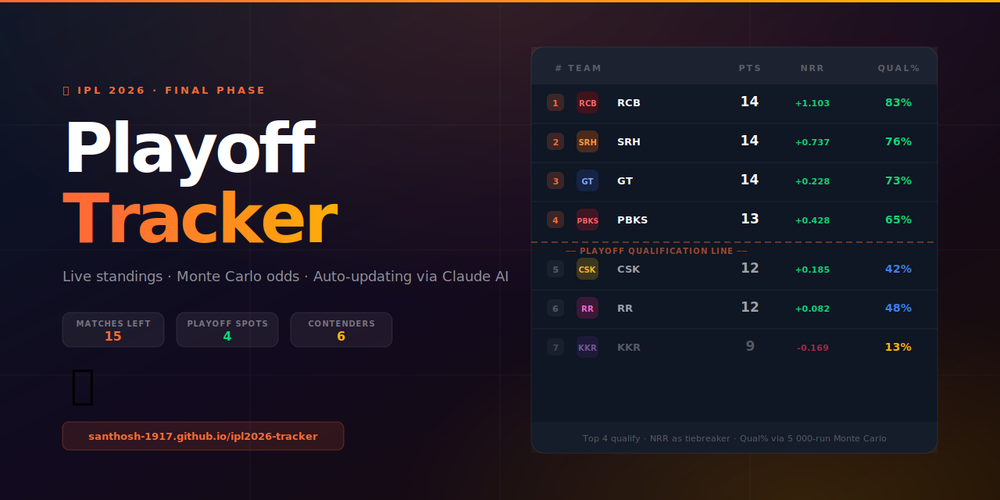
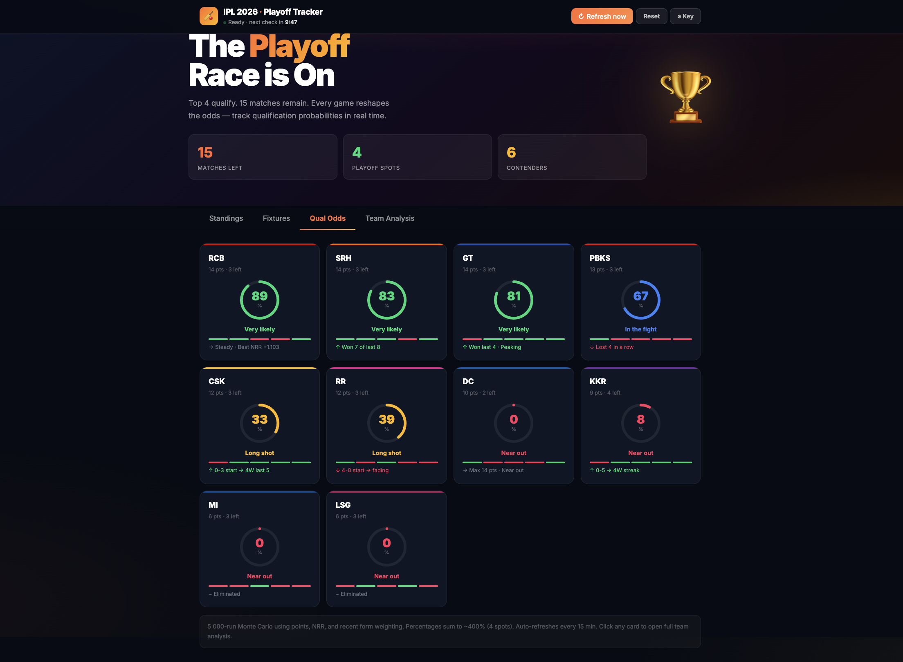
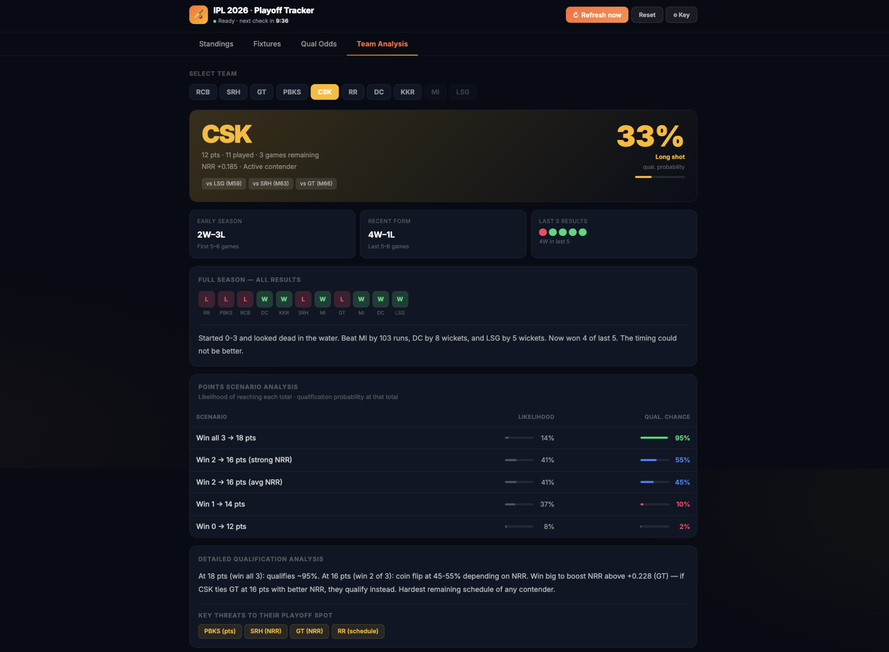
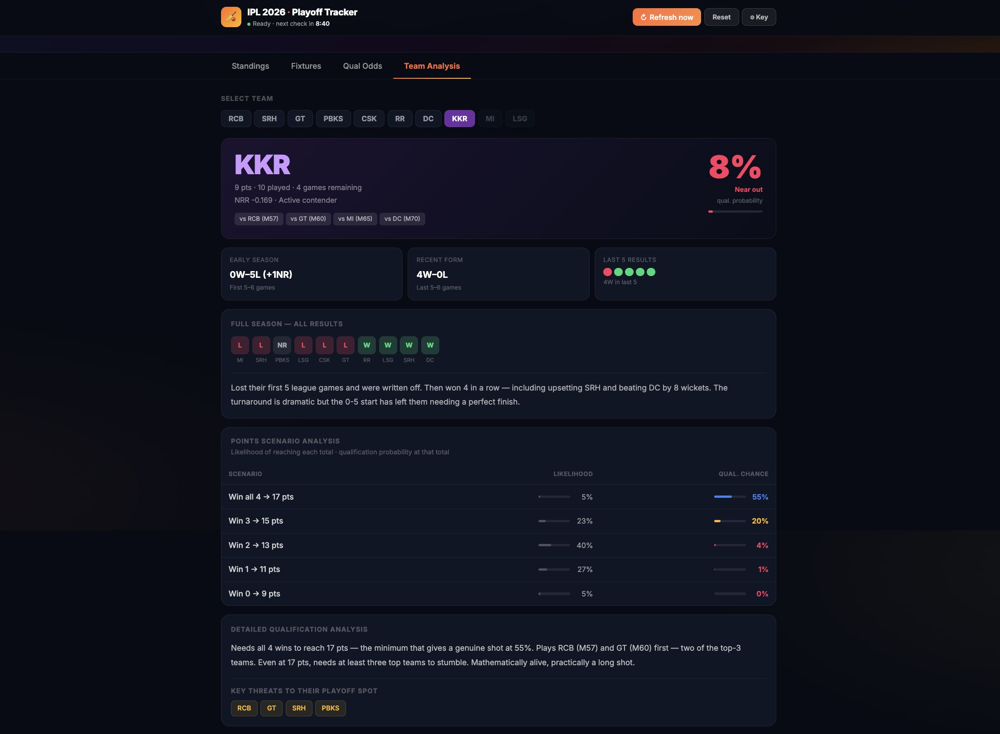

<div align="center">



# 🏆 IPL 2026 · Playoff Tracker

**Live standings · Monte Carlo qualification odds · Per-team deep analysis**  
Auto-updates after every match using Claude AI web search.

[](https://santhosh-1917.github.io/ipl2026-tracker/)
[](https://anthropic.com)
[](https://react.dev)
[](index.html)

</div>

---

## ✨ Features

| Feature | Details |
|---------|---------|
| 📊 **Live Standings** | Points table with NRR, form dots, team color coding |
| 🎲 **Monte Carlo Odds** | 5 000-simulation qualification % per team, recalculated live |
| 🔄 **Auto Refresh** | Fetches new match results every 15 min via Claude AI web search |
| 🔍 **Team Analysis** | Full form arc, scenario table, threats, and written analysis per team |
| 📅 **Fixtures** | Upcoming schedule + completed results with margins |
| 📱 **Responsive** | Works on mobile, tablet, and desktop |
| 💾 **Persistent** | Standings saved in localStorage — refreshing the page keeps your data |

---

## 🖥️ Screenshots

### Qualification Odds — circular progress rings, team color accents


### Team Analysis — CSK deep dive with scenario table


### Team Analysis — KKR comeback story


---

## 🚀 Quick Start

### Option 1 — Use the live site
Visit **[santhosh-1917.github.io/ipl2026-tracker](https://santhosh-1917.github.io/ipl2026-tracker/)** and enter your Anthropic API key.

### Option 2 — Run locally
```bash
# No install needed — just open the file
open index.html
```
Or drag `index.html` into any browser.

### Getting an API key
1. Go to [console.anthropic.com](https://console.anthropic.com)
2. Sign up (free tier available)
3. Create an API key
4. Paste it into the tracker's setup screen

> Your key is stored in your browser's `localStorage` only. It is never sent anywhere except directly to Anthropic's API.

---

## 🎯 Current Standings (as of Match 55)

| # | Team | Pts | NRR | Qual% | Status |
|---|------|-----|-----|-------|--------|
| 1 | RCB | 14 | +1.103 | 73% | ↑ Steady · Best NRR |
| 2 | SRH | 14 | +0.737 | 76% | ↑ Won 7 of last 8 |
| 3 | GT | 14 | +0.228 | 83% | ↑ Won last 4 · Peaking |
| 4 | PBKS | 13 | +0.428 | 65% | ↓ Lost 4 in a row |
| 5 | CSK | 12 | +0.185 | 42% | ↑ 0-3 start → 4W last 5 |
| 6 | RR | 12 | +0.082 | 48% | ↓ 4-0 start → fading |
| 7 | DC | 10 | -0.993 | 2% | → Max 14 pts · Near out |
| 8 | KKR | 9 | -0.169 | 13% | ↑ 0-5 → 4W streak |
| 9 | MI | 6 | -0.585 | 0% | ✕ Eliminated |
| 10 | LSG | 6 | -0.907 | 0% | ✕ Eliminated |

*Qualification % via 5 000-run Monte Carlo simulation*

---

## ⚙️ How It Works

```
User clicks Refresh
  → Claude AI (claude-sonnet-4-20250514 + web_search tool)
    fetches live IPL 2026 results from the web
  → Results parsed from JSON response
  → applyRes() updates team standings (pts, W, L, form)
  → runMC() runs 5 000 Monte Carlo simulations
  → Qualification % recalculated for all 10 teams
  → State persisted to localStorage
  → UI updates automatically
```

### Win Probability Model
Each simulated match uses a logistic probability function over:
- Points difference (weight: 0.07)
- NRR difference (weight: 0.18)
- Recent form — last 5 results (weight: 0.09)
- Output clamped to [17%, 83%] — no match is a certainty

---

## 🛠️ Tech Stack

| Layer | Technology |
|-------|-----------|
| UI | React 18 (CDN, no build step) |
| Styling | Pure CSS with CSS custom properties |
| Fonts | Google Fonts — Inter |
| AI | Anthropic API — `claude-sonnet-4-20250514` |
| Search | Claude tool — `web_search_20250305` |
| Storage | Browser `localStorage` |
| Hosting | GitHub Pages |

Zero dependencies to install. Single `index.html` file.

---

## 📁 File Structure

```
ipl2026-tracker/
├── index.html          ← entire app (HTML + CSS + React)
├── assets/
│   ├── preview.svg     ← social preview / OG image
│   └── favicon.svg     ← browser favicon
├── README.md           ← this file
└── CLAUDE.md           ← technical documentation for Claude Code
```

---

## 🔧 Updating for Future Matches

Edit these constants in `index.html` to keep it current:

```js
// Current standings
const INIT_STD = [ ... ]

// Remaining fixtures
const SCHED = [ ... ]

// Per-team written analysis
const ANA = { ... }
```

---

## 📄 License

MIT — free to use, modify, and host.

---

<div align="center">

Built with ❤️ for cricket fans · Powered by [Claude AI](https://anthropic.com)

</div>
